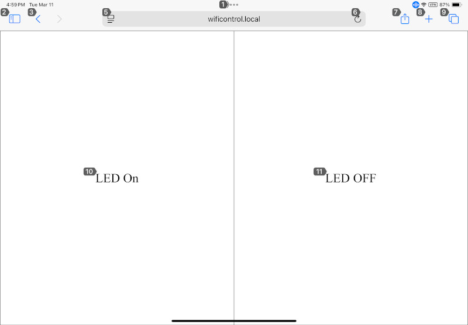
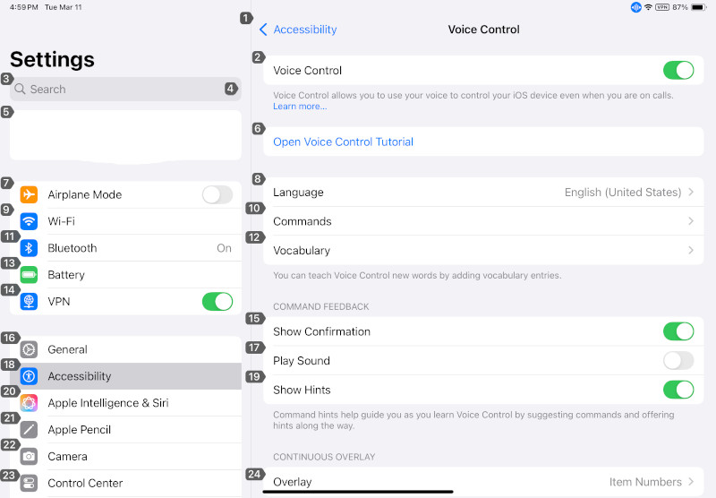
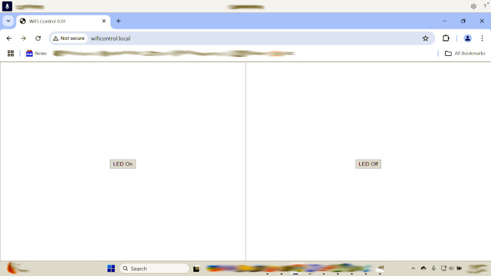
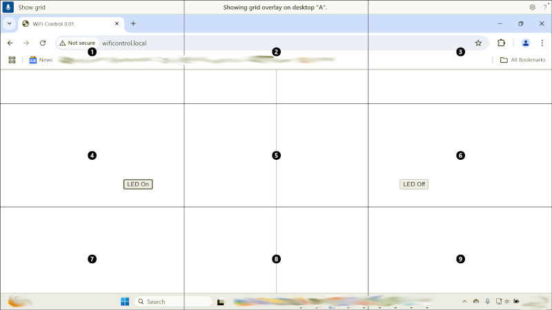
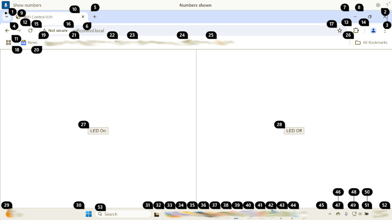
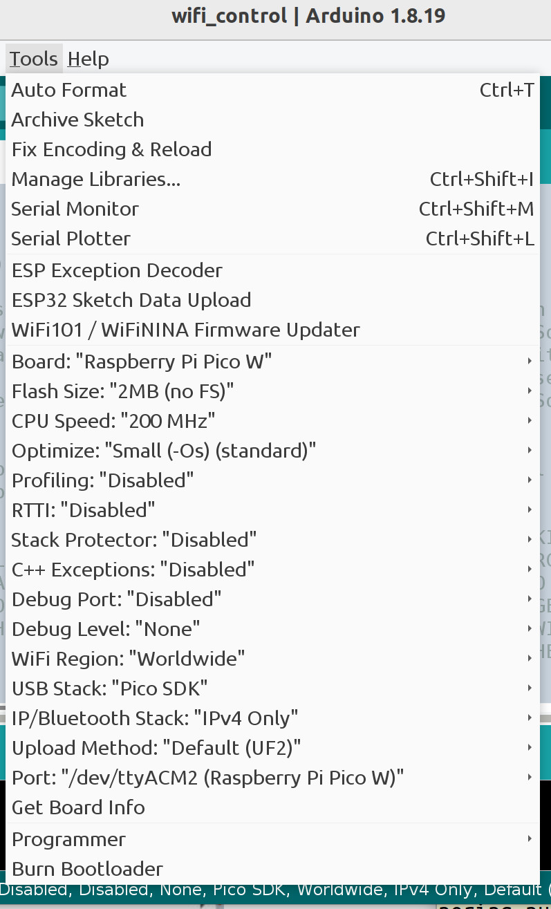
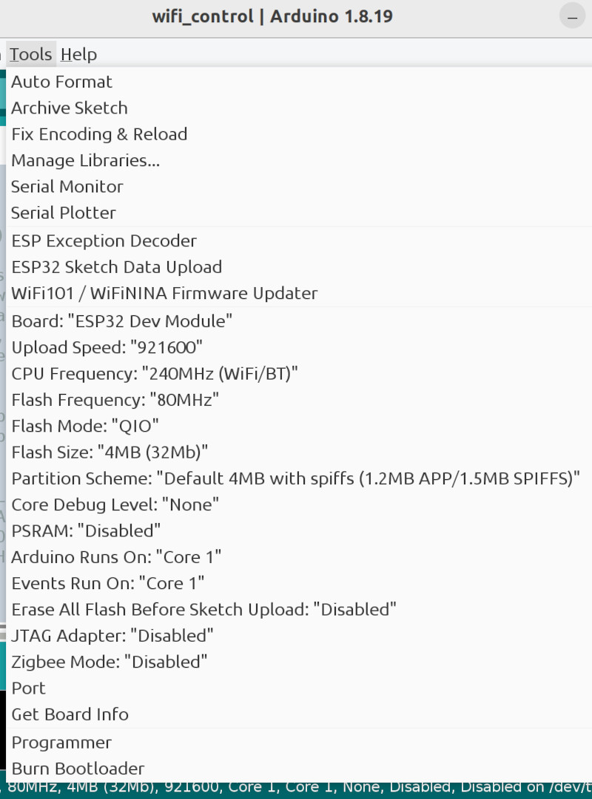

# wifi_control -- Add voice control to your Arduino project

Apple iPhones and iPads have numerous accessibility features such as voice
control and eye gaze tracking (newer models). MacOS computers have built-in
support for camera based head tracking and voice control. Windows computers
with the installation of third party software support various accessibility
methods such as eye gaze and camera based head tracking, etc. Windows 11
Accessibility supports "Voice Access" which is similar to "Voice Control" on
Apple devices.

This Arduino project demonstrates the use of a web page interface to bridge
between iPhone and iPad Voice Control and microcontroller boards with WiFi. The
supported boards are Raspberry Pi Pico W, Raspberry Pi Pico 2 W, and ESP32 with
WiFi.

Other access methods such as eye gaze and head tracking may also be used but
the focus here is on Apple Accessibility Voice Control.

For simplicity, a single LED is supported but any hardware a microcontroller
can control may have a web page interface. For example, motors, servos, relays,
LED strings and arrays, TV IR senders, etc.

<kbd></kbd>

Both Apple and Microsoft promise Voice Control and Voice Access do all voice
processing on the device. Voice recordings are not sent to servers in the
Internet cloud. But be sure to turn off any voice diagnostic or improvement
options because enabling these options do send recordings back to Apple or
Microsoft.

If you are using Amazon Echo devices, be aware as of March 28, 2025 all voice
recordings will be sent to Amazon servers for processing. The private local
voice processing option will be removed.

## Control an LED using Voice Control



Safari is connected to the web server on the WiFi board with Voice Control
enabled. Since the application is trivial, there are only two options on the
web page for LED on and LED off. The targets are large as possible to make them
easy to press. The LED on the WiFi board can be controlled by touching the
screen. Or by speaking the number next to the targets. For example, speaking
"10" turns the LED on. Another option is to speak the name of the target. For
example, speaking "Tap LED off" turns the LED off.

The Voice Control configuration screen on an iPad is shown next. The iPhone
screen is nearly identical so it is not shown.



## Control an LED using Windows 11 Voice Access



Since the buttons have labels, the LED can be turned on by saying "click LED
on".



Turn on the mouse grid by saying "show grid". Saying "click 6" turns the LED off.



Turn on the mouse numbers by saying "show numbers". Saying "click 27" turns the LED on.

## Hardware

One of the following.

* Pi Pico W
* Pi Pico 2 W
* ESP32 with WiFi

## Software

Arduino IDE 1.8.19 with the Arduino-Pico board package by Earle F. Philhower,
III. This project should work with the Arduino IDE 2.x. This project also works
with ESP32 boards although most of the testing has been done on a Pi Pico W
board.

[Installation instructions for the Arduino IDE](https://www.arduino.cc/en/software)

[Installation instructions for Arduino-Pico boards](https://arduino-pico.readthedocs.io/en/latest/install.html)

[Installation instructions for ESP32 boards](https://docs.espressif.com/projects/arduino-esp32/en/latest/installing.html)

Once the Board option is set to "Raspberry Pi Pico W", the other options are
left at default values.



Once the Board option is set to "ESP32 Dev Module", the other options are left at
default values. This board does not have a built-in LED but other variants do.




## Libraries

The library is installed using the IDE Library Manager.

* "WebSockets" by Markus Sattler

## secrets.h is missing

secrets.h is not included because it must contain the SSID and passphrase for
your WiFi network. Or you can modify the INO file to remove `#include
"secrets.h` then add your SSID and passphrase to the INO file. Be sure not to
publish your secrets to the world.

secrets.h should include something like the following.

```c
#define STASSID "myssid"
#define STAPSK "mypassphrase"
```
